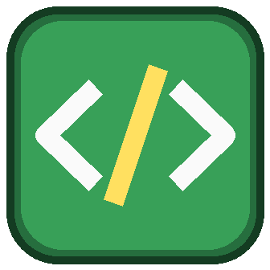

# GDCode - write Geometry Dash levels as code

A [Geode](https://geode-sdk.org) mod for Geometry Dash **2.2081** (Geode **v5.10.x**) that adds a small
level-scripting language. You write a script in an in-game editor, the mod compiles it
(`Lexer -> Parser -> AST -> semantic checks -> Level IR -> GD level string`) and creates a
**real, editable, playable level** in *My Levels*.

<p align="center"></p>

```
# examples/hello.gdx
level "Hello GDCode" {
    speed: normal
    mode: cube
    bg: #287DC8
    ground: #0F5FA8
    seed: 42
}

repeat 60 as i {          # a floor
    block i 0
}

define tower(x, height) { # a reusable pattern
    repeat height as j {
        block x j + 1
    }
}

tower(18, 2)
tower(24, 3)
spike 8 1
spike half 14 1
orb yellow 21 4
pad pink 33 1
portal ship 38 3
repeat 6 as k {
    spike 42 + k * 3 random(1, 2)   # deterministic thanks to seed
}
```

## Features

| | |
|---|---|
| **Language** | objects (`block`, `spike`, `saw`, `orb`, `pad`, `portal`, `startpos`, `coin`, raw `obj <id>`), object properties (`rot`, `scale`, `flipX/Y`, `group`, `color`, `layer`, `zOrder`), a `level { ... }` settings block (speed, gamemode, colors, song, mini/dual/flip/2p/platformer, seed), `var`, `repeat ... as i`, `define` patterns, arithmetic, seeded `random()` |
| **Editor** | in-game multi-line editor (line numbers, caret keys, auto-indent, Tab, undo/redo, Ctrl+V), clipboard copy/paste/import as the escape hatch, live *Problems* panel with line/column + "did you mean" suggestions, click a problem to jump to it |
| **Generation** | real `GJGameLevel` created through the game's own factory, level string verified by a compress/decompress round trip before anything is written; regenerate in place with confirmation, or fork with *New Level*; warns if you edited the level by hand since the last generation |
| **Safety** | limits on source size, objects (setting), loop counts/nesting, pattern depth, compile time; the compiler never throws, never hangs and collects many errors at once |
| **Determinism** | same script + same seed = byte-identical level, on every platform (own xorshift RNG, no `std::` distributions) |
| **Storage** | one folder per project in the mod save dir (`main.gdx` + `project.json`), plain text |

## Using it

1. Install the `.geode` (see *Build* below or grab the CI artifact), start GD.
2. Press the green **`</>`** button in the main menu.
3. **New** -> name your project -> the editor opens with a starter script.
4. Write code; problems show up on the right as you type.
5. **Generate**. The level opens in the editor (or its level page / nothing - see the mod settings).
6. Edit the script and **Generate** again to update the same level; **New Level** creates a separate one.

Press **?** in the editor for the built-in reference. Full syntax: [docs/DSL.md](docs/DSL.md).

Settings (Geode mod settings): *After generating a level* (`editor` / `level-page` / `stay`),
*Confirm before regenerating*, *Object limit*.

## Repository layout

```
core/      compiler library - pure C++20, zero Geode/GD dependencies
  include/gdcode/   Lexer, Parser, Ast, Lowering (semantics), Ir, Catalog, Encoder, Compiler, Diagnostic, Rng, Limits
src/       the Geode mod
  backend/          LevelBackend: IR -> real GJGameLevel (the only GD-level-touching code)
  storage/          ProjectStore: projects on disk
  ui/               CodeEditor, EditorPopup, ProjectsPopup, HelpPopup
  main.cpp          MenuLayer button
tests/     7 host-side test suites + golden snapshots (no game needed)
cli/       gdcode-cli: compile scripts from a terminal
examples/  sample scripts
docs/      DSL.md (language), ARCHITECTURE.md, BUILD.md, LIMITATIONS.md
```

## Build

Mod (needs the Geode SDK + CLI, Clang 19 / MSVC 19.44 per Geode's requirements):

```sh
geode build
```

Compiler core, tests and CLI (any C++20 compiler, no game):

```sh
cmake -S . -B build-core -G Ninja -DCMAKE_BUILD_TYPE=Debug
cmake --build build-core
ctest --test-dir build-core --output-on-failure
./build-core/gdcode-cli examples/hello.gdx --level-string
```

CI (`.github/workflows/build.yml`) runs the tests and builds the mod for Windows, macOS, iOS,
Android32 and Android64, then uploads the combined `.geode` as the artifact
**GDCode (all platforms)**. Details: [docs/BUILD.md](docs/BUILD.md).

## How the level is produced

1. The compiler turns the script into a `LevelIR`: level settings + a list of objects with
   GD object ids and positions in GD units (block `(gx, gy)` -> `(gx*30+15, gy*30+15)`,
   verified against decoded official level data).
2. The encoder writes the raw GD level string: a `kS38` color header + `kA*` start
   settings in the 2.2 editor's layout, then one `key,value,...;` record per object
   (keys 1 id, 2 x, 3 y, 4/5 flips, 6 rotation, 13 checked, 20 layer, 21 color, 24/25 z, 32 scale, 33 group).
3. The backend compresses it with `ZipUtils::compressString(raw, false, 0)` - the exact
   form the game keeps in `GJGameLevel::m_levelString` - checks the round trip, creates
   the level with `GameLevelManager::createNewLevel()` and fills name, description, song,
   object count and length.

More in [docs/ARCHITECTURE.md](docs/ARCHITECTURE.md); known limitations and the in-game
verification checklist in [docs/LIMITATIONS.md](docs/LIMITATIONS.md).

## Status

v0.1.0 - MVP. Triggers, a bigger object catalogue, conditionals and a block-based editor
are intentionally out of scope for this version; the IR and catalog are designed so they can
be added as data.

## License

MIT - see [LICENSE](LICENSE).
